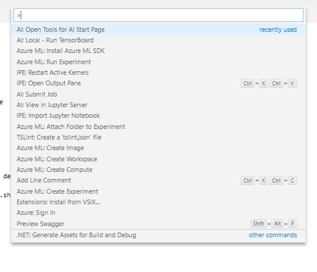
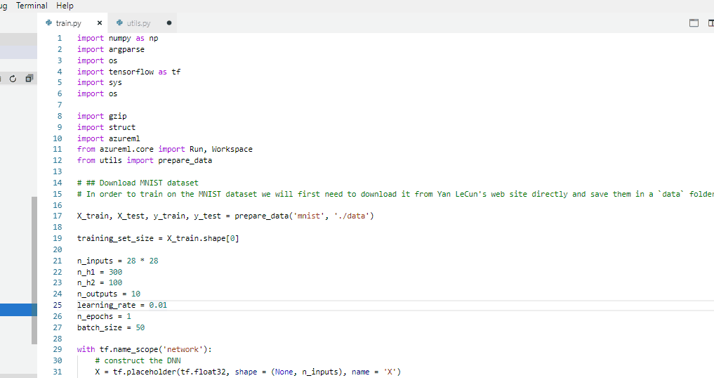
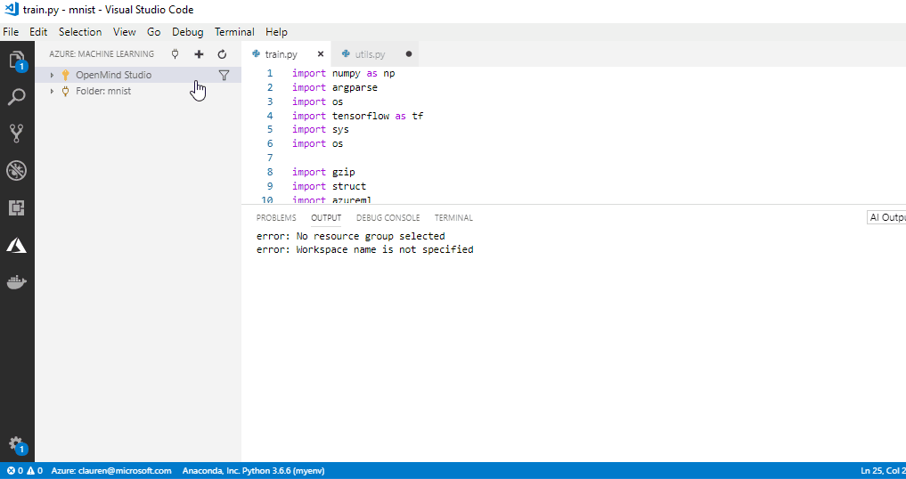
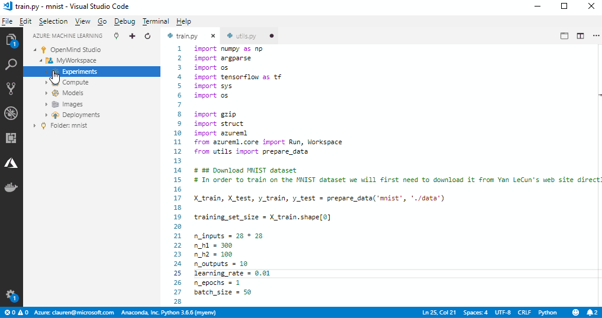

# Getting started with Azure Machine Learning in Visual Studio Code
Visual Studio Code Tools for AI is an extension to build, test, and deploy machine learning and deep learning models. It seamlessly integrates with Azure Machine Learning for robust experimentation capabilities, including but not limited to running data preparation and model training experiments both locally and on remote compute targets.

Additionally, it provides support for tracking custom metrics and experiment runs, enabling data science reproducibility and auditability.

## Installing Visual Studio Code

Visual Studio Code is a lightweight but powerful source code editor which runs on your desktop and is available for Windows, macOS and Linux. It comes with built-in support for JavaScript, TypeScript and Node.js and has a rich ecosystem of extensions for other languages (such as C++, C#, Java, Python, PHP, Go) and runtimes (such as .NET and Unity). Begin your journey with VS Code with these [introductory videos](https://code.visualstudio.com/docs/introvideos/overview).

Please see [Visual Studio Code installation instructions](https://code.visualstudio.com/docs/setup/setup-overview) for more details

## Using Visual Studio Code
All of the Azure Machine Learning features in VS Code are accessible from the keyboard. The most important key combination to know is Ctrl+Shift+P, which brings up the Command Palette. From here, you have access to all of the functionality of VS Code, including keyboard shortcuts for the most common operations.

## Using Python in Visual Studio Code

Working with Python in Visual Studio Code, using the [Microsoft Python extension](https://marketplace.visualstudio.com/items?itemName=ms-python.python), is simple, fun, and productive. The extension makes VS Code an excellent IDE, and works on any operating system with a variety of Python interpreters. It leverages all of VS Code's power to provide auto complete and IntelliSense, linting, debugging, and unit testing, along with the ability to easily switch between Python environments, including virtual and conda environments.

- To learn more about Python in Visual Studio Code [see the docs](https://code.visualstudio.com/docs/languages/python)
- For a walkthrough of editing, running, and debugging code, see the [Python Hello World Tutorial](https://code.visualstudio.com/docs/languages/python/docs/python/python-tutorial)

> **Tip**: Check out the [IntelliCode extension for VS Code (preview)](https://go.microsoft.com/fwlink/?linkid=2006060). IntelliCode provides a set of AI-assisted capabilities for IntelliSense in Python, such as inferring the most relevant auto-completions based on the current code context.

## Installing Visual Studio Code Tools for AI
To install the extension, the easist way is using the command Extensions: Install from VSIX... in the Command Palette. Please refer to the VS Code doc for details.

Tools for AI depends on two more extensions, Azure Account and Python. Once Tools for AI is installed, these dependent extensions would be installed automatically if users have connected to the Internet.

## Preparing Visual Studio Code for Azure Machine Learning

### Log into your Azure Account
The [Azure Account extension](https://marketplace.visualstudio.com/items?itemName=ms-vscode.azure-account) was automatically installed in Visual Studio Code during the prior step. 

Please use it to login by using the `Azure: Sign In` command 

To learn more about how to create or filter your Azure subscriptions, here is a quick reference of the commands available 

| Command |  |
| --- |---|
| `Azure: Sign In`  | Sign in to your Azure subscription.
| `Azure: Sign Out` | Sign out of your Azure subscription.
| `Azure: Select Subscriptions` | Pick the set of subscriptions you want to work with. 
| `Azure: Create an Account`  | If you don't have an Azure Account, you can [sign up](https://azure.microsoft.com/en-us/free/?utm_source=campaign&utm_campaign=vscode-azure-account&mktingSource=vscode-azure-account) for one today and receive $200 in free credits.

### Install the Azure Machine Learning SDK

1. Open the command palette `Ctrl+Shift+P`
2. Type Install Azure ML SDK to find the command to install the Azure Machine Learning SDK. This will be installed via a pip install command. It will create a local private Python environment which has the Visual Studio Code prerequisites for working with Azure Machine Learning.
3. In the integrated terminal window you will be prompted to specify the Python interpreter to use, or you can simply hit **Enter** to use your default Python interpreter.

  > **NOTE:** If you try to perform any task in Visual Studio Code which requires the Azure Machine Learning SDK and you have not already installed it, or have installed a different version, a warning notification will alert you and you can click a button in the notification to install.

## Getting started with Azure Machine Learning

### Create an Azure Machine Learning workspace

1. Open the Azure activity bar in Visual Studio Code
1. Open the Azure Machine Learning view
1.Right-click your Azure subscription and select `Create Workspace`. 
1. Select an existing resource group or create a new one using the wizard in the command palette.
1. Specify a name for your new workspace
1. Hit enter

### Create an Azure Machine Learning experiment

This will enable you to keep track of your experiments using Azure Machine Learning

1. Right-click the `MNISTWorkspace` and select `Create Experiment`from the context menu.
1. Name your experiment and hit enter

### Attach your folder to your experiment

This will enable associating each of your experiment runs with your experiment so all of your key metrics will be stored in the experiment history and the models you train will get automatically uploaded to Azure Machine Learning and stored with your experimment metrics and logs.

## Congratulations!
You have successfully prepared Visual Studio Code for use with Azure Machine Learning.

- To learn how to create and use Azure Virtual Machines, Azure Batch AI clusters and Azure Kubernetes clusters from Visual Studio Code to train and deploy your models, see [Create and manage compute targets in Visual Studio Code](manage-compute-aml-vscode.md)
- To learn how to train models and manage your experiments from Visual Studio Code , see [Training models and managing experiments in Visual Studio Code](train-models-aml-vscode.md)
- To learn how to deploy and manage models from Visual Studio Code , see [Deploying and managing models in Visual Studio Code](deploy-models-aml-vscode.md)